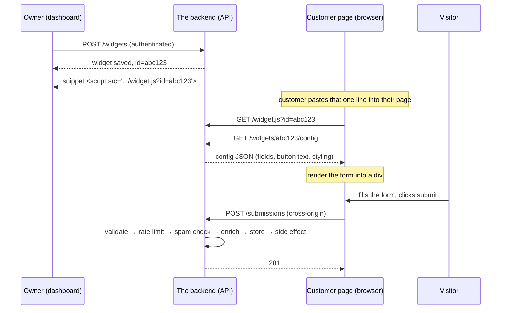

# Application design

## The high-level design

## Data models (fields, tenancy, indexes)

> All types are PostgreSQL. `timestamptz` = UTC timestamp, `jsonb` = schema-flexible JSON.
> Tenancy rule: every widget and submission query is filtered by `tenant_id`
> (submissions join `widgets`); a tenant can never read another tenant's rows.

### tenants — the widget owner (customer)

| Column | Type | Constraints / notes |
| --- | --- | --- |
| `id` | `uuid` | PK, default `gen_random_uuid()` |
| `name` | `text` | NOT NULL |
| `email` | `citext` | NOT NULL, UNIQUE — login identity |
| `password_hash` | `text` | NOT NULL — bcrypt/argon2 hash; plaintext is never stored (secrets rule) |
| `created_at` | `timestamptz` | NOT NULL, default `now()` |

### widgets — one row per embeddable widget

| Column | Type | Constraints / notes |
| --- | --- | --- |
| `id` | `uuid` | PK, default `gen_random_uuid()` |
| `tenant_id` | `uuid` | FK → `tenants.id`, NOT NULL, indexed — tenancy isolation |
| `public_id` | `varchar(12)` | NOT NULL, UNIQUE — unguessable id in `" }` |
| Invalid | `400` | `{ error: { code: "VALIDATION_FAILED", message: "…" } }` |
| No / invalid token | `401` | `{ error: { code: "UNAUTHORIZED", message: "…" } }` |

#### `GET /api/v1/widgets/:id` — read one

| Case | Status | Body |
| --- | --- | --- |
| Success | `200` | `{ widget }` |
| Not yours / missing | `404` | `{ error: { code: "WIDGET_NOT_FOUND", message: "…" } }` — tenant-scoped, existence not leaked |
| No / invalid token | `401` | `{ error: { code: "UNAUTHORIZED", message: "…" } }` |

#### `PATCH /api/v1/widgets/:id` — update one

| Case | Status | Body |
| --- | --- | --- |
| Success | `200` | `{ widget }` |
| Invalid | `400` | `{ error: { code: "VALIDATION_FAILED", message: "…" } }` |
| Not yours / missing | `404` | `{ error: { code: "WIDGET_NOT_FOUND", message: "…" } }` |

#### `DELETE /api/v1/widgets/:id` — delete one

| Case | Status | Body |
| --- | --- | --- |
| Success | `204` | empty |
| Not yours / missing | `404` | `{ error: { code: "WIDGET_NOT_FOUND", message: "…" } }` |

### Dashboard (authenticated)

#### `GET /api/v1/widgets/:id/submissions?page=1&perPage=50` — paginated submissions

| Case | Status | Body |
| --- | --- | --- |
| Success | `200` | `{ data: [ { id, payload, ip, countryCode, city, geoProvider, submittedAt } ], page, perPage, total }` |
| Not yours / missing | `404` | `{ error: { code: "WIDGET_NOT_FOUND", message: "…" } }` |
| No / invalid token | `401` | `{ error: { code: "UNAUTHORIZED", message: "…" } }` |

#### `GET /api/v1/dashboard/summary` — aggregate stats

| Case | Status | Body |
| --- | --- | --- |
| Success | `200` | `{ totals: { submissions }, byWidget: [ … ], byDay: [ … ], byCountry: [ … ] }` |
| No / invalid token | `401` | `{ error: { code: "UNAUTHORIZED", message: "…" } }` |

## Not building
- drag-and-drop widget creator
- third-party CRM integrations (HubSpot / Salesforce sync)
- custom domains, CDN, or hosted serving — everything runs locally
 